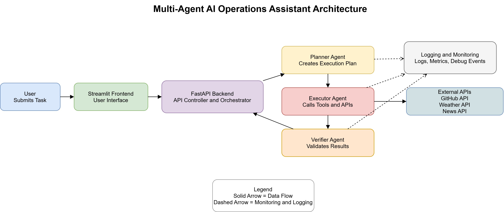

# Multi-Agent AI Operations Assistant

A GenAI-powered multi-agent system that interprets user tasks, plans execution steps, calls external tools, and verifies final results using autonomous AI agents.

---

##  Objective

Build an intelligent assistant capable of:

- Understanding natural language prompts
- Converting prompts into structured execution plans
- Calling external APIs dynamically
- Validating outputs before returning results

---

## System Architecture
<p align="center">
  
</p>

### Architecture Workflow
The system processes user requests through a structured multi-agent pipeline to ensure reliable and verified results.

#### Step 1 — User Request
The user submits a natural language task through the Streamlit interface.

#### Step 2 — Frontend Processing
Streamlit forwards the request to the FastAPI backend for processing.

#### Step 3 — Planning Phase
The Planner Agent analyzes the user request and generates structured execution steps by identifying required tools and APIs.

#### Step 4 — Execution Phase
The Executor Agent executes the planned steps by calling internal tools and external APIs such as GitHub, Weather, or News services.

#### Step 5 — Data Aggregation
The Executor collects responses from all tools and organizes them into a structured format.

#### Step 6 — Verification Phase
The Verifier Agent validates results to ensure accuracy, completeness, and consistency.

#### Step 7 — Final Response
The verified results are returned to the frontend and displayed to the user.

---

## Agent Responsibilities

### Planner Agent
- Uses LLM reasoning
- Converts prompt into structured execution steps
- Selects appropriate tools dynamically

### Executor Agent
- Calls third-party APIs
- Aggregates results
- Handles tool orchestration

### Verifier Agent
- Validates executor output
- Detects missing or incomplete results
- Ensures response consistency

---

##  Third-Party APIs Used

### 1. Groq LLM API
Used for structured planning and reasoning.

### 2. GitHub REST API
Retrieves repository information including:
- Repository name
- Stars
- Description
- Repository URL

### 3. OpenWeather API
Provides real-time weather data including:
- Temperature
- Humidity
- Weather conditions

### 4. News API (Optional Extension)
Provides latest news retrieval capability.

---

## 📂 Project Folder Structure
```
Multi-Agent-AI-operation-Assistant
│
├── agents
│   ├── planner.py
│   ├── executor.py
│   └── verifier.py
│
├── tools
│   ├── github_tool.py
│   ├── weather_tool.py
│   └── news_tool.py
│
├── llm
│   ├── llm_config.py
│   └── logger.py
│
├── main.py
├── app.py
├── requirements.txt
├── .env.example
└── README.md
```

---

##  Local Setup Instructions

Follow these steps exactly to run the project locally.


### Step 1 — Clone Repository
```bash
git clone https://github.com/rithik-cyber/Multi-Agent-AI-operation-Assistant.git
cd Multi-Agent-AI-operation-Assistant
```

### Step 2 — Create Virtual Environment
## Windows
```bash
python -m venv venv
venv\Scripts\activate
```

## MAC/Linux
```bash
python3 -m venv venv
source venv/bin/activate
```

### Step 3 — Install Dependencies
```bash
pip install -r requirements.txt
```

### Step 4 — Configure Environment Variables
```bash
GROQ_API_KEY=your_key_here
GITHUB_TOKEN=your_token_here
WEATHER_API_KEY=your_key_here
NEWS_API_KEY=your_key_here
```

### Step 5 — Run Backend
```bash
uvicorn main:app --reload
```

### Step 6 — Run Streamlit UI
```bash
streamlit run app.py
** before Launching streamlit make sure Backend is running.**
```


## Example Prompts
Try the following prompts in the Streamlit interface:
```
Find machine learning repositories and weather in Delhi
Show Python repositories and weather in Mumbai
Give weather updates for Punjab, Delhi, and Bangalore
Find trending AI repositories
Show weather in Chennai and ML repositories
```

## End-to-End Execution Flow
- User enters prompt
- Planner creates structured execution plan
- Executor calls APIs and gathers data
- Verifier validates outputs
- UI displays final verified result

## Logging and Monitoring
The system logs:
- Agent reasoning steps
- Tool execution results
- Errors and failures
- Execution summaries

## Known Limitations
- Duplicate repositories may appear across queries
- Limited tool set (expandable architecture)
- No persistent execution history storage
- News API not fully exposed in UI

## Design Tradeoffs
- Modularity vs Performance: 
The system favors modular expansion over maximum runtime optimization.
- Verification Layer: 
Adds reliability but slightly increases response latency.

## Extensibility
The architecture supports easy addition of:
- Additional agents
- More API integrations
- Database storage
- Memory and caching layers

## Tech Stack
- Python
- FastAPI
- Streamlit
- Groq LLM
- REST APIs
- Async Programming